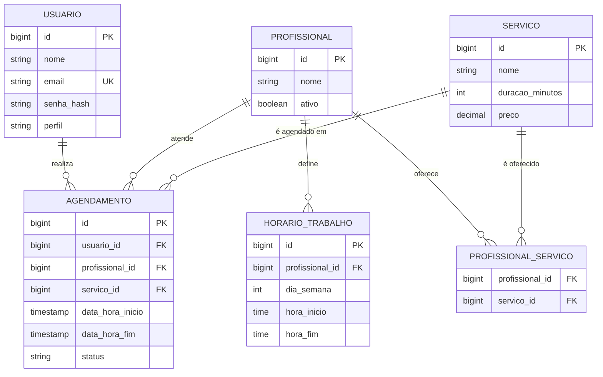

# Diagrama do banco

```mermaid
erDiagram
  USUARIO ||--o{ AGENDAMENTO : realiza
  PROFISSIONAL ||--o{ AGENDAMENTO : atende
  SERVICO ||--o{ AGENDAMENTO : "é agendado em"
  PROFISSIONAL ||--o{ HORARIO_TRABALHO : define
  PROFISSIONAL ||--o{ PROFISSIONAL_SERVICO : oferece
  SERVICO ||--o{ PROFISSIONAL_SERVICO : "é oferecido"
  USUARIO {
    bigint id PK
    string nome
    string email UK
    string senha_hash
    string perfil
  }
  PROFISSIONAL {
    bigint id PK
    string nome
    boolean ativo
  }
  SERVICO {
    bigint id PK
    string nome
    int duracao_minutos
    decimal preco
  }
  PROFISSIONAL_SERVICO {
    bigint profissional_id FK
    bigint servico_id FK
  }
  HORARIO_TRABALHO {
    bigint id PK
    bigint profissional_id FK
    int dia_semana
    time hora_inicio
    time hora_fim
  }
  AGENDAMENTO {
    bigint id PK
    bigint usuario_id FK
    bigint profissional_id FK
    bigint servico_id FK
    timestamp data_hora_inicio
    timestamp data_hora_fim
    string status
  }
```